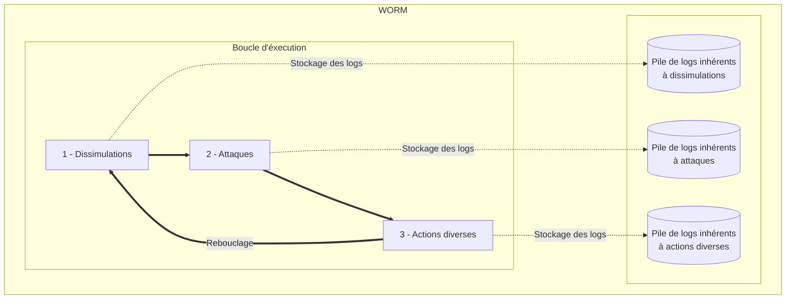

# Framworm
Framworm est un vers informatique éducaatif et qui se veut modulable.

## Architecture
Voici l'architecture macroscopique de notre vers :

Les composants *Dissimulations*, *Attaques* et *Actions diverses* sont des modules codés par l'utilisateur.

